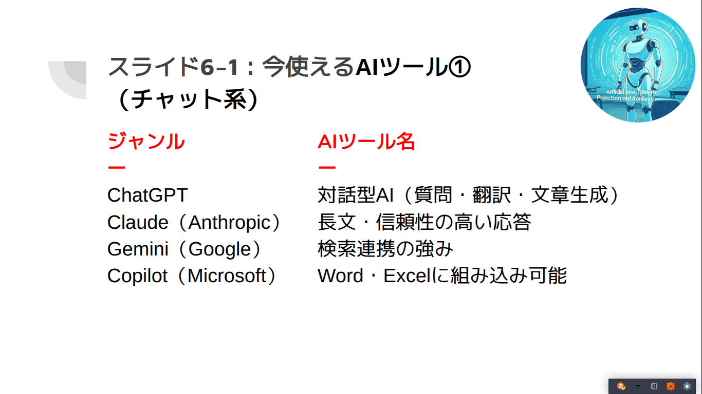

# AI Promptに**Prompt**の使い方を聞いてみよう

Lecture AI Omas@ITカレッジ沖縄

---
# Profile 

- 大舛(おおます) 直彦
- ITカレッジ沖縄スペシャリスト科講師
- Mail: omas@it-college.ac.jp
- 専門分野:
    - Programming
    - Cyber Security
    - Cloud Technology

---
# Profile 

 

- 資格・スキル
    - Cisco Academic Instructor
    - Oracle Academic Instructor
    - CompTIA Specialist
        - IT Operations
        - System Support
    - HSK 4級 
- 趣味・関心
    - 海外旅行
    - 飲み歩き
---
# Menu

- AI Introduction
- AI Hands On(Prompt makes prompt)
    - NoteBookLM
    - Copilot
- Try it & Presentation
---

# AI Introduction

AIの仕組みと活用

---

# 

---

# 

---

# 

---

# 

---

# 

---

# 

---

# 

---

# 

---

# 

---

# 

---

# 

---

# 

---

# 生成AIの学校現場における利活用に関する要約

---

## 1. 生成AIの特性と基本的な考え方

- 生成AIは急速に普及し、文章・動画像・音声など様々な情報を扱える
- 学校現場でも利活用の幅が広がっている
- 誤った出力（ハルシネーション）、バイアスなどのリスクも存在
- 「人間中心の原則」：AIは補助・拡張の道具、最終判断は人間

---

## 2. 情報活用能力の育成強化

- 学習指導要領で「情報活用能力」が基盤とされている
- 生成AIの仕組み理解・活用力を各教科で育む姿勢が重要

---

## 3. 児童生徒の学習活動における生成AIの利活用

- 利活用は教育活動の目的達成に効果的か吟味
- 利活用のポイント
    - 発達段階や情報活用能力に留意
    - 「学ぶ場面」「使い方を学ぶ場面」「積極的に用いる場面」を組み合わせる
    - 情報モラル教育としてAIの誤りを教材に活用

---

## 具体的な利活用例

- グループでのアイデア出しや議論の深化
- 英会話相手や自然な英語表現への改善
- プログラミング授業でのアイデア実現

---

# AIを使った英語アプリ例(会話)

## [DuoLingo Max](https://ja.duolingo.com/help/what-is-duolingo-max)

DuolingoMax は AIを活用した「スマート解説」「ロールプレイ」「リリーとビデオ通話」といった機能が利用できます

---

# AIを使った英語アプリ例(発音)

## [Bold Voice](https://www.boldvoice.com/)

BoldVoiceは、英語のアクセントトレーニングアプリです。 専門家のアクセントコーチからのビデオで学びあなたの声を録音して即座に発音のフィードバックがえられます

---

## 利活用時の留意点

- ***年齢制限や利用規約の遵守***
- ***個人情報や著作権侵害に注意***
- 教師が出力内容の適切性を判断
- 生成物の成果物利用・引用時は出典記載
- 保護者への情報提供と周知

---

## 4. 教職員の校務における生成AIの利活用

- 校務効率化や質向上、働き方改革に期待
- 新技術への慣れと利便性・懸念点の理解が重要
- 内容の適切性を判断できる範囲で積極的に利活用

---

## 教職員の具体的な利活用例

- ***授業準備（教材・テスト問題作成）***
- 部活動・生徒指導業務支援
- 学校運営（通知文・案内文作成、日程調整）
- 外部対応支援

---

## 校務利用時の留意点

- AIサービスの利用規約遵守
- ***重要な個人情報は原則入力しない***
- ***個人情報保護法・著作権侵害に注意***
- バイアス等を理解し、教職員が内容を判断
- 管理職は適切な利活用を確認

---

## 5. 教育委員会等が押さえておくべきポイント

- 制度設計や方向性の提示が重要
- 学校の実態を踏まえた柔軟な対応
- 教育情報セキュリティポリシーの策定・見直し
- 個人情報・著作権侵害リスクへの対応
- 事例・教材・ノウハウの共有、研修の実施

---

# まとめ

- AIは急速に普及し、多様な場面で活用が進んでおり様々な種類がある
- 利用には情報活用能力や情報モラル、年齢・規約・個人情報保護などの配慮が不可欠
- AIの仕組みをきちんと理解して道具としてうまく使う能力が必要

---

# Prompt makes prompt

- 多くの人が、生成AIを活用する上で、プロンプトの作成に苦戦しています
    - プロンプトをどう書けばいいか分からない
    - プロンプトの質が低くうまく行かない
---    

# Solution

- プロンプトにプロンプトの使い方を聞く
- 他の人の成功例を真似る

---

# プロンプトにプロンプトの使い方を聞く

1.  自身の業務において、生成AIがどのように使えるかを質問し、アイデアを出してもらいます。
2. 次に、特定の用途で使うプロンプト例の作成を依頼します。
3.  さらに、**「プロンプトガイドラインに沿って、より効果的なプロンプトを作成して」**と指示することで、より高品質なプロンプトにブラッシュアップできます。

[プロンプトガイドライン](https://prompt-ya.com/openai-prompt-guide/)
--- 

# インターネットでプロンプト例を調べる。

- ChatGPT プロンプト例
- 画像生成AI プロンプト テンプレート
- X投稿 プロンプト

---
# Try IT & Presentation

ペアを組んでプロダクトを作成し10分弱のプレゼンテーションを行う

---

# Regulation

- ペアを組んで生成AIを使ったプロダクトを作成(notebookLMには共有機能がある)
- 上記プロダクトを10分弱のプレゼン(生成AIにプレゼンファイルの生成を頼む?)
- まとまらない場合個別に作ってもよいがプレゼンを5分弱とする

---
# Start

